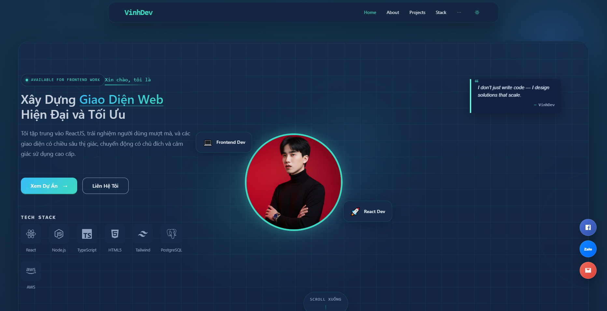

# VinhDev Portfolio

Portfolio cá nhân của **Phạm Công Vinh (Vinhdev04)**, xây dựng với **React + Vite + Ant Design + Framer Motion**.

Website tập trung vào:
- giao diện hiện đại, đồng bộ dark/light mode
- animation và scroll effect mượt
- blog trình bày dễ đọc
- responsive tốt trên desktop, tablet và mobile
- tối ưu tải trang bằng lazy loading và chia nhỏ bundle

## Demo
- GitHub: [Vinhdev04](https://github.com/Vinhdev04)
- Repository: [V_Potofolio](https://github.com/Vinhdev04/V_Potofolio)

## Tính năng chính

### Frontend
- Trang `Home`, `About`, `Projects`, `Skills`, `Experience`, `Certificates`, `Contact`, `Blog`, `Blog Detail`
- Theme `dark / light` đồng bộ toàn website
- Route transition, reveal animation, hover animation, scroll progress
- Floating actions: `Facebook`, `Zalo`, `Email`, `Back to top`
- Blog list có filter và blog detail theo layout đọc bài
- Các bài blog tương tác được lazy load theo từng nội dung
- Layout responsive cho mobile, tablet, desktop

### Kỹ thuật
- Router tách trang bằng `React.lazy` + `Suspense`
- `Framer Motion` cho page transition và scroll animation
- `SCSS` + CSS variables cho theme token
- Bundle splitting để giảm tải chunk nặng ở blog detail

### Backend
Thư mục `Backend/` đang là phần mở rộng tùy nhu cầu. Hiện trọng tâm chính của repo là frontend portfolio.

## Công nghệ sử dụng
- React 18
- Vite 5
- React Router DOM 6
- Ant Design 5
- Framer Motion
- SCSS
- React Icons

## Cấu trúc thư mục

```txt
V_Potofolio/
|-- Frontend/
|   |-- src/
|   |   |-- assets/
|   |   |-- components/
|   |   |-- context/
|   |   |-- data/
|   |   |-- pages/
|   |   |-- routes/
|   |   `-- main.jsx
|   |-- package.json
|   `-- vite.config.js
|-- Backend/
|-- netlify.toml
`-- README.md
```

## Chạy local

### Frontend
```bash
cd Frontend
npm install
npm run dev
```

Mặc định chạy tại:

```txt
http://localhost:5173
```

### Build production
```bash
cd Frontend
npm run build
```

### Preview build
```bash
cd Frontend
npm run preview
```

## Deploy

### Netlify
Repo đã có `netlify.toml`. Có thể deploy với:
- Base directory: `Frontend`
- Build command: `npm run build`
- Publish directory: `dist`

### GitHub Pages
Frontend đã có script:

```bash
cd Frontend
npm run deploy
```

Nếu deploy GitHub Pages, cần kiểm tra lại `base` trong [vite.config.js](/d:/V_Potofolio/Frontend/vite.config.js) cho đúng môi trường deploy.

## Một số cập nhật gần đây
- Đồng bộ dark/light mode toàn site
- Nâng cấp UI blog và blog detail
- Sửa lỗi route transition khi quay lại `Home`
- Tối ưu responsive cho `About`, `Projects`, `Contact`, `Navbar`, `Footer`
- Tách lazy loading cho blog widgets để giảm tải `BlogDetail`

## Thông tin liên hệ
- GitHub: [github.com/Vinhdev04](https://github.com/Vinhdev04)
- Facebook: [facebook.com/i.padygamy1210](https://www.facebook.com/i.padygamy1210)
- Email: `PCV.FED@GMAIL.COM`
- Zalo: `0352032375`

## License
Dùng cho mục đích portfolio cá nhân và trình bày dự án.
